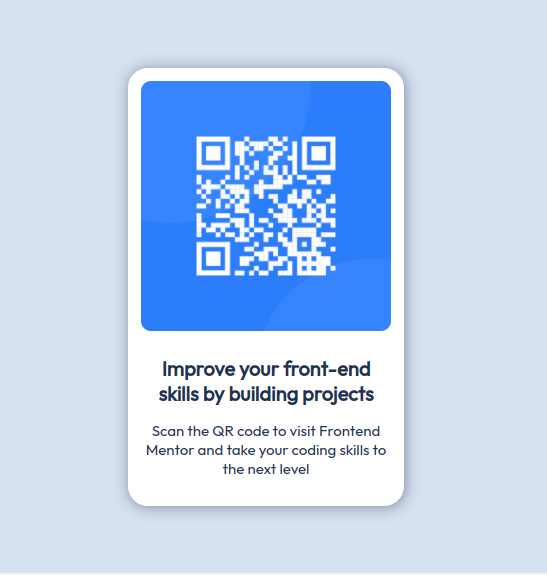

# Frontend Mentor - QR code component solution

This is a solution to the [QR code component challenge on Frontend Mentor](https://www.frontendmentor.io/challenges/qr-code-component-iux_sIO_H). Frontend Mentor challenges help you improve your coding skills by building realistic projects.

## Table of contents

- [Frontend Mentor - QR code component solution](#frontend-mentor---qr-code-component-solution)
  - [Table of contents](#table-of-contents)
  - [Overview](#overview)
    - [Screenshot](#screenshot)
    - [Links](#links)
  - [My process](#my-process)
    - [Built with](#built-with)
  - [Author](#author)

## Overview

### Screenshot

### Links

- Live Site URL: [QR Code Static Page](https://qr-code-static-page.netlify.app)

## My process

This page doesn't have any functionality, it's just a static page to practice html and css.
The only thing it has is a block with a QR code

### Built with

- Semantic HTML5 markup
- CSS custom properties
- Flexbox

## Author

- Telegram - [cmglezpdev](https://t.me/cmglezpdev)
- Frontend Mentor - [@cmglezpdev](https://www.frontendmentor.io/profile/cmglezpdev)
- Twitter - [@CMGlezP](https://www.twitter.com/CMGlezP)
